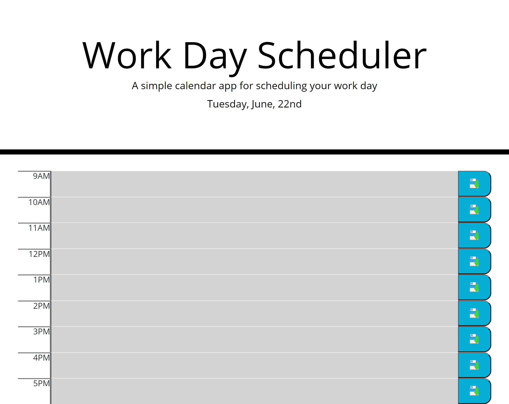

# work-day-scheduler-repo
Work Day Scheduler

## Description

- What was your motivation?

    My motivation for tackling the project was to learn how to use moment methods to display time and day of the week in HTML and CSS using JavaScript code.

- Why did you build this project? (Note: the answer is not "Because it was a homework assignment.")

    I built the project to further develop my javascript skills using moment methods and localStorage. 

- What problem does it solve?

    Learning about moment and localStorage helps with creating specfic date and times depending on time zones of the user and storing information locally.

- What did you learn?

    I learned different types of moment methods different type of information storage to improve my javascript learning.

## ScreenShot

## Link to Deployed Website

https://acromarti01.github.io/work-day-scheduler-repo/

